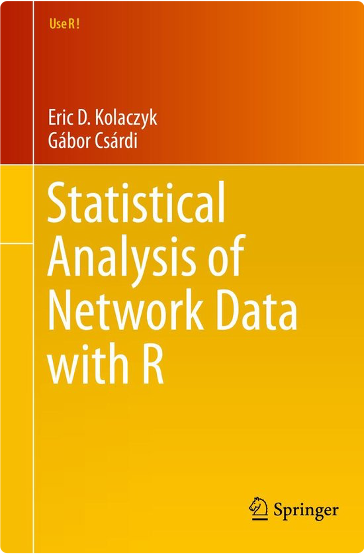
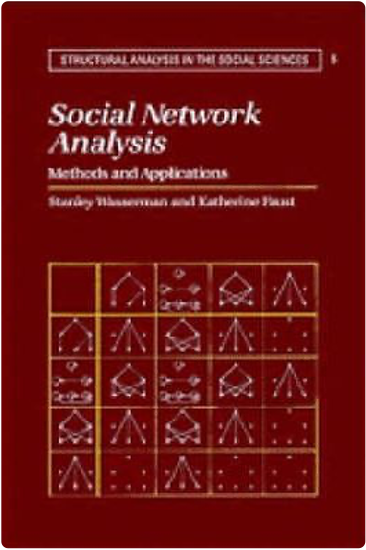
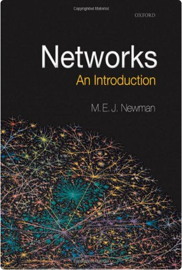

## Useful intermediate books for graph/network theory

---

## Spectral Graph Theory

[Why use the laplacian matrix Q&A](https://math.stackexchange.com/questions/3457993/why-do-we-use-the-laplacian-matrix-in-spectral-clustering)

[Spectral Graph Clustering tutorial](https://people.csail.mit.edu/dsontag/courses/ml14/notes/Luxburg07_tutorial_spectral_clustering.pdf) : A great introduction to spectral clustering methods,using Laplacian matrices derived from graph adjacency matrices.

[Spectral Graph Theory material](https://ocw.mit.edu/courses/18-409-topics-in-theoretical-computer-science-an-algorithmists-toolkit-fall-2009/pages/lecture-notes/) : the first set of lectures is quite good and useful.

---

## Graph Databases 

### Books

</a>

### GraphDB and Graph Query Languages Courses/Tutorials

[Neo4j Graph academy](https://graphacademy.neo4j.com/)

[Gremlin Query Language guide](https://kelvinlawrence.net/book/Gremlin-Graph-Guide.html)

[Wikidata SPARQL tutorial](https://www.wikidata.org/wiki/Wikidata:SPARQL_tutorial)

---

## Knowledge Graphs Books and resources

- [Alan Turing Institute KG interest group](https://github.com/turing-knowledge-graphs): A great resource for everyone interested in knowledge graphs. Great material such as [this KG course](https://github.com/turing-knowledge-graphs/teaching/tree/main/city)