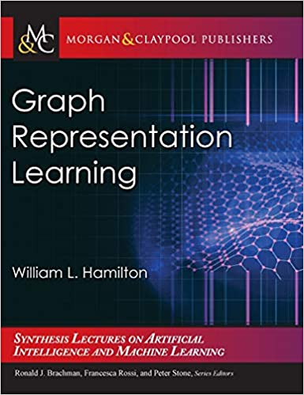

    
## Advanced Graph material

    
### Machine Learning with Graphs course:
    
Check out this valuable set of lectures from Stanford University on Machine Learning with Graphs. These lectures, along with the book below provided for free by the author, offer a solid foundation in the subject. Both resources are highly recommended for those looking to understand machine learning with graphs.

- [CS224W: Machine Learning with Graphs course page](http://web.stanford.edu/class/cs224w/)
- [CS224W: Machine Learning with Graphs course videos on youtube](https://www.youtube.com/playlist?list=PLoROMvodv4rPLKxIpqhjhPgdQy7imNkDn)

 
    
---